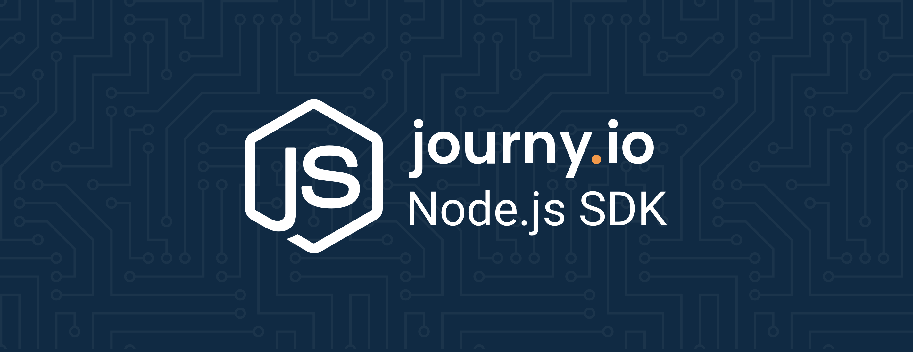

[](https://journy.io/?utm_source=github&utm_content=readme-js-sdk)

# journy.io Node.js SDK

[](https://www.npmjs.com/package/@journyio/sdk)
[](https://www.npmjs.com/package/@journyio/sdk)

This is the official Node.js SDK for [journy.io](https://journy.io?utm_source=github&utm_content=readme-js-sdk).

## 💾 Installation

You can use your package manager (`npm` or `yarn`) to install the SDK:

```bash
npm install --save @journyio/sdk
```
or
```bash
yarn add @journyio/sdk
```

## 🔌 Getting started

### Import

To start, first import the client.

```ts
import { Client } from "@journyio/sdk";
```

### Configuration

To be able to use the journy.io SDK you need to generate an API key. If you don't have one you can create one in [journy.io](https://system.journy.io?utm_source=github&utm_content=readme-js-sdk).

If you don't have an account yet, you can create one in [journy.io](https://system.journy.io/register?utm_source=github&utm_content=readme-js-sdk) or [request a demo first](https://www.journy.io/book-demo?utm_source=github&utm_content=readme-js-sdk).

Go to your settings, under the *Connections*-tab, to create and edit API keys. Make sure to give the correct permissions to the API Key.

```ts
const client = Client.withDefaults("your-api-key");
```

If you want to use a custom [HttpClient](https://github.com/journy-io/http):

```ts
const http = new OwnHttpClientImplementation();
const client = new Client(http, { apiKey: "your-api-key" });
```

### Methods

#### Get API key details

```ts
const result = await client.getApiKeyDetails();

if (result.success) {
  console.log(result.data.permissions); // string[]
  console.log(result.data.callsRemaining); // number
}
```

#### Create or update user

_Note: when sending an empty value (`""`) as value for a property, the property will be deleted._

```ts
await client.upsertUser({
  // required
  userId: "userId", // Unique identifier for the user in your database
  email: "name@domain.tld",

  // optional
  properties: {
    age: 26,
    name: "John Doe",
    is_developer: true,
    registered_at: new Date(/* ... */),
    this_property_will_be_deleted: "",
  },
});
```

#### Create or update account

_Note: when sending an empty value (`""`) as value for a property, the property will be deleted._

```ts
await client.upsertAccount({
  // required
  accountId: "accountId", // Unique identifier for the account in your database
  name: "journy.io",

  // optional
  properties: {
    age: 26,
    name: "John Doe",
    is_developer: true,
    registered_at: new Date(/* ... */),
    this_property_will_be_deleted: "",
  },

  // optional
  members: ["userId", "userId"], // Unique identifier for the user in your database
});
```

#### Link web visitor to an app user

You can link a web visitor to a user in your application when you have our snippet installed on your website. The snippet sets a cookie named `__journey`. If the cookie exists, you can link the web visitor to the user that is currently logged in:

```ts
if (request.cookies["__journey"]) {
  const result = await client.link({
    deviceId: request.cookies["__journey"],
    userId: request.user.id, // Unique identifier for the user in your database
  });
}
```

(The above example is for express based applications using [https://github.com/expressjs/cookie-parser](https://github.com/expressjs/cookie-parser))

#### Add event

```ts
import { Event } from "./Client";

event = Event.forUser("login", "userId");
event = Event.forUser("some_historic_event", "userId").happenedAt(new Date(...));
event = Event.forAccount("reached_monthly_volume", "accountId").withMetadata({
  "number": 1313,
  "string": "string",
  "boolean": true,
});
event = Event.forUserInAccount("updated_settings", "userId", "accountId");

await client.addEvent(event);
```

#### Get tracking snippet for a domain

```ts
const result = await client.getTrackingSnippet({
  domain: "www.journy.io",
});

if (result.success) {
  console.log(result.data.snippet); // string
  console.log(result.data.domain); // string
}
```

### Handling errors

Every call will return a result, we don't throw errors when a call fails. We don't want to break your application when things go wrong. An exception will be thrown for required arguments that are empty or missing.

You can check whether the call succeeded using `result.success`:

```ts
const result = await client.getTrackingSnippet({
  domain: "www.journy.io",
});

if (!result.success) {
  console.log(result.error); // string
  console.log(result.requestId); // string
}

await client.getTrackingSnippet({
  domain: "", // empty string will throw
});
```

The request ID can be useful when viewing API logs in [journy.io](https://system.journy.io?utm_source=github&utm_content=readme-js-sdk).


## 📬 API Docs

[API reference](https://developers.journy.io)

## 💯 Tests

To run the tests:

```bash
npm run test
```

## ❓ Help

We welcome your feedback, ideas and suggestions. We really want to make your life easier, so if we’re falling short or should be doing something different, we want to hear about it.

Please create an issue or contact us via the chat on our website.

## 🔒 Security

If you discover any security related issues, please email hans at journy io instead of using the issue tracker.
